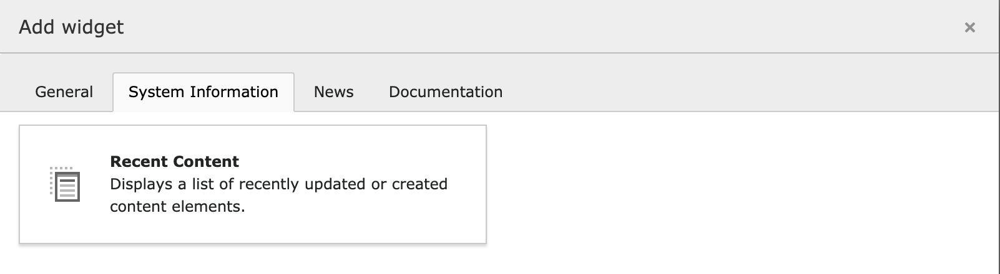
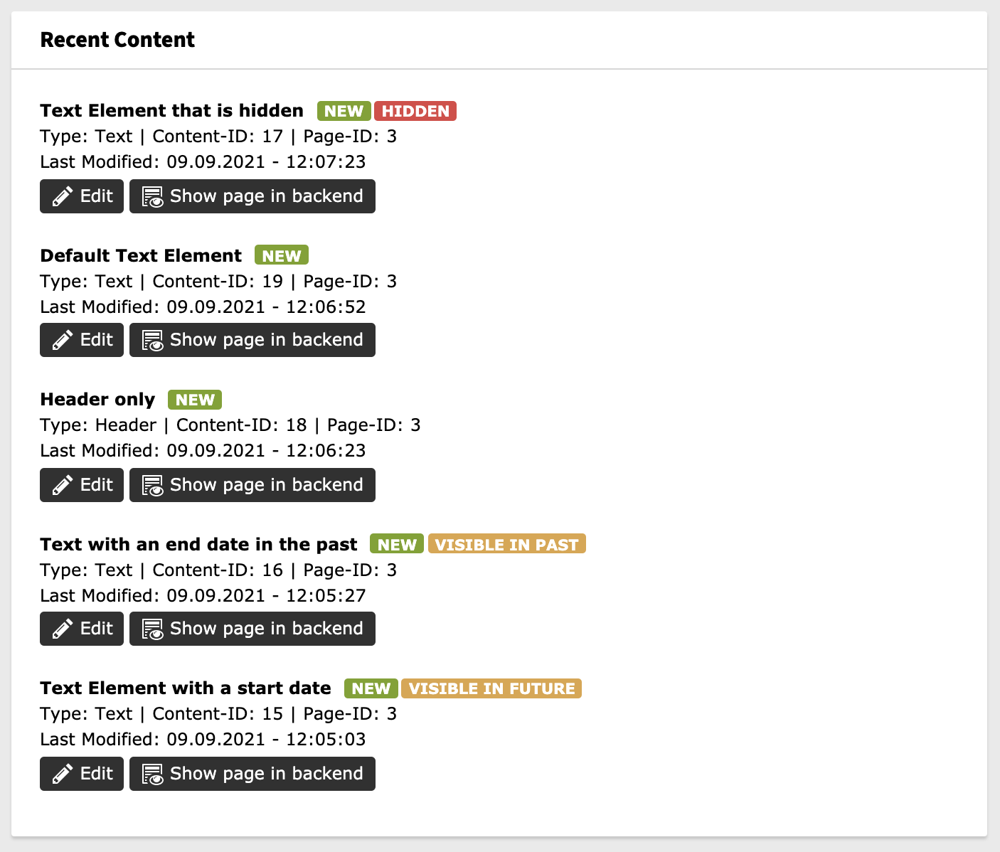

# Recent Content Widget

This TYPO3 extension provides two dashboard widgets - one that displays a list of last modified or created content elements, and one that displays a list of last modified or created pages.

Access and user permissions are handled to ensure permissions to show only accessible content elements and pages for the current backend user.

## Credit

This extension is based om https://github.com/Epixskill/recent-content-widget but an additional widget is added.